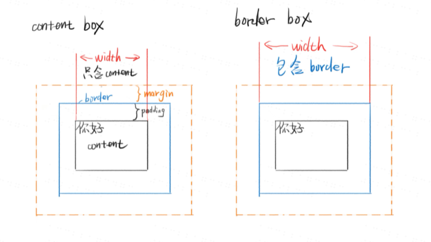

## 盒模型分为两种

1. content-box 内容盒-内容就是盒子的边界
2. border-box 边框盒-框架才是盒子的边界

## 公式

1. content-box width=内容宽度
2. border-box width=内容宽度+padding+border

## margin合并

1. 父子margin合并
2. 兄弟margin合并

## 如何阻止合并

1. 父子合并用padding/border挡住
2. 父子合并用overflow:hidden挡住
3. 父子合并用display:flex,不知道为什么,记就完了。
4. 兄弟合并是符合预期的
5. 兄弟合并可以用inline-block消除

